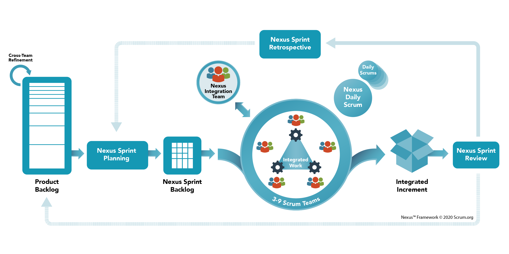

# Purpose of the Nexus Guide

Product delivery is complex, and the integration of product[Product] development work into a valuable product[Product] requires coordinating many diverse activities.
Nexus[Nexus] is a framework[Framework,ScaledScrum] for developing and sustaining scaled product[Product] delivery initiatives.
It builds upon Scrum, extending it only where absolutely necessary to minimize and manage dependencies between multiple Scrum Teams[ScrumTeams] while promoting empiricism[Empiricism] and the Scrum Values[ScrumValues].

The Nexus framework[Framework] inherits the purpose and intent of the Scrum framework[Framework] as documented in the Scrum Guide (www.scrumguides.org.) Scaled Scrum is still Scrum.
Nexus[Nexus] does not change the core design or ideas of Scrum, or leave out elements, or negate the rules of Scrum.[ExtendScrum]
Doing so covers up problems and limits the benefits of Scrum, potentially even rendering it useless.

This Guide contains the definition of Nexus.
Each element of the framework[Framework] serves a specific purpose that is essential to help teams[ScrumTeams] and organizations[Organization] scale the benefits of Scrum with multiple teams[ScrumTeams] working together.

As organizations use Nexus, they typically discover complementary patterns, processes, and practices that help them in their application of the Nexus framework.
As with Scrum, such tactics vary widely and are described elsewhere.

Ken Schwaber and Scrum.org developed Nexus.

# Nexus Definition

A Nexus[Nexus] is a group of approximately three to nine Scrum Teams[ScrumTeams] that work together to deliver a single product[Product]; it is a connection between people and things.
A Nexus[Nexus] has a single Product Owner[ScrumTeam,ProductOwner] who manages a single Product Backlog[ScrumArtifacts,ProductBacklog] from which the Scrum Teams[ScrumTeams] work.

The Nexus framework[Framework] defines the accountabilities[Accountable], events[ScrumEvents], and artifacts[ScrumArtifacts] that bind and weave together the work of the Scrum Teams[ScrumTeams] in a Nexus[Nexus].
Nexus[Nexus] builds upon Scrum's foundation, and its parts will be familiar to those who have used Scrum.
It minimally extends the Scrum framework[Framework] only where absolutely necessary to enable multiple teams[ScrumTeams] to work from a single Product Backlog[ScrumArtifacts,ProductBacklog] to build an Integrated Increment[NexusIntegratedIncrement,ScrumArtifacts,Increment] that meets a goal.

# Nexus Theory

At its heart, Nexus[Nexus] seeks to preserve and enhance Scrum's foundational bottom-up intelligence and empiricism[Empiricism] while enabling a group of Scrum Teams[ScrumTeams] to deliver more value[ValueDelivery] than can be achieved by a single team[ScrumTeam].
The goal of Nexus[Nexus] is to scale the value[ValueDelivery] that a group of Scrum Teams[ScrumTeams], working on a single product[Product], is able to deliver.
It does this by reducing the complexity[ReduceComplexity] that those teams[ScrumTeams] encounter as they collaborate to deliver an integrated, valuable, useful product Increment[NexusIntegratedIncrement,ScrumArtifacts,Increment] at least once every Sprint[ScrumEvents,Sprint].

The Nexus Framework[Framework] helps teams[ScrumTeams] solve common scaling challenges like reducing cross-team[CrossTeam] dependencies[Impediments], preserving team[ScrumTeam] self-management[SelfManagement] and transparency[EmpiricalScrumPillars,Transparency], and ensuring accountability[Accountable].
Nexus[Nexus] helps to make transparent[EmpiricalScrumPillars,Transparency] dependencies.
These dependencies are often caused by mismatches related to:

1. Product structure: The degree to which different concerns are independently separated in the product will greatly affect the complexity of creating an integrated product release.
2. Communication structure: The way that people communicate within and between teams[ScrumTeams] affects their ability to get work done; delays in communication and feedback reduce the flow[Flow] of work.

Nexus[Nexus] provides opportunities to change the process, product structure, and communication structure to reduce or remove these dependencies.

While often counterintuitive, scaling the value[ValueDelivery] that is delivered does not always require adding more people.
Increasing the number of people and the size of a product[Product] increases complexity and dependencies, the need for collaboration, and the number of communication pathways involved in making decisions.
Scaling-down, reducing the number of people who work on something, can be an important practice in delivering more value[ValueDelivery].

# The Nexus Framework[Framework,ScaledScrum]

Nexus[Nexus] builds upon Scrum by enhancing the foundational elements of Scrum in ways that help solve the dependency and collaboration challenges of cross-team[CrossTeam] work.
Nexus[Nexus] (see Figure 1) reveals an empirical[Empiricism] process that closely mirrors Scrum.

Nexus[Nexus] extends Scrum in the following ways:

- Accountabilities[Accountable]: The Nexus Integration Team[NexusIntegrationTeam] ensures that the Nexus[Nexus] delivers a valuable, useful Integrated Increment[NexusIntegratedIncrement,ScrumArtifacts,Increment] at least once every Sprint[ScrumEvents,Sprint]. The Nexus Integration Team[NexusIntegrationTeam] consists of the Product Owner[ScrumTeam,ProductOwner], a Scrum Master[ScrumTeam,ScrumMaster], and Nexus Integration Team[NexusIntegrationTeam] Members.
- Events[NexusEvents]: Events are appended to, placed around, or replace regular Scrum events[ScrumEvents] to augment them. As modified, they serve both the overall effort of all Scrum Teams[ScrumTeams] in the Nexus[Nexus], and each individual team. A Nexus Sprint Goal[NexusSprintGoal] is the objective for the Sprint[ScrumEvents,Sprint].
- Artifacts[ScrumArtifacts]: All Scrum Team[ScrumTeams] use the same, single Product Backlog[ScrumArtifacts,ProductBacklog]. As the Product Backlog items[ScrumArtifacts,ProductBacklog,ProductBacklogItem] are refined and made ready, indicators of which team will most likely do the work inside a Sprint[ScrumEvents,Sprint] are made transparent[EmpiricalScrumPillars,Transparency]. A Nexus Sprint Backlog[NexusSprintBacklog] exists to assist with transparency[EmpiricalScrumPillars,Transparency] during the Sprint[ScrumEvents,Sprint]. The Integrated Increment[NexusIntegratedIncrement,ScrumArtifacts,Increment] represents the current sum of all integrated work completed by a Nexus[Nexus].

Figure 1: The Nexus Framework

# Accountabilities in Nexus[Accountable]

A Nexus[Nexus] consists of Scrum Teams[ScrumTeams] that work together toward a Product Goal[ScrumArtifacts,ProductBacklog,Commitment,ProductGoal].
The Scrum framework[Framework] defines three specific sets of accountabilities[Accountable] within a Scrum Team[ScrumTeam]: the Developers[ScrumTeam,Developers], the Product Owner[ScrumTeam,ProductOwner], and the Scrum Master[ScrumTeam,ScrumMaster].
These accountabilities[Accountable] are prescribed in the Scrum Guide.
In Nexus[Nexus], an additional accountability[Accountable] is introduced, the Nexus Integration Team[NexusIntegrationTeam].

## Nexus Integration Team[NexusIntegrationTeam]

The Nexus Integration Team[NexusIntegrationTeam] is accountable[Accountable] for ensuring that a done Integrated Increment[NexusIntegratedIncrement,ScrumArtifacts,Increment] (the combined work completed by a Nexus[Nexus]) is produced at least once a Sprint[ScrumEvents,Sprint].
It provides the focus that makes possible the accountability[Accountable] of multiple Scrum Teams[ScrumTeams] to come together to create valuable, useful Increments[ScrumArtifacts,Increment], as prescribed in Scrum.

While Scrum Teams[ScrumTeams] address integration issues[Impediments] within the Nexus[Nexus], the Nexus Integration Team[NexusIntegrationTeam] provides a focal point of integration for the Nexus[Nexus].
Integration includes addressing technical and non-technical cross-functional team[CrossTeam] constraints that may impede a Nexus[Nexus]' ability to deliver a constantly Integrated Increment[NexusIntegratedIncrement,ScrumArtifacts,Increment].
It should use bottom-up intelligence from within the Nexus[Nexus] to achieve resolution.

The Product Owner[ScrumTeam,ProductOwner], a Scrum Master[ScrumTeam,ScrumMaster], and the appropriate members from the Scrum Teams[ScrumTeams] belong to the Nexus Integration Team[NexusIntegrationTeam].
Appropriate members are the people with the necessary skills and knowledge to help resolve the issues the Nexus faces at any point in time.
Composition of the Nexus Integration Team[NexusIntegrationTeam] may change over time to reflect the current needs of a Nexus.
Common activities the Nexus Integration Team[NexusIntegrationTeam] might perform include coaching, consulting, and highlighting awareness of dependencies and cross-team[CrossTeam] issues.

The Nexus Integration Team[NexusIntegrationTeam] consists of:

- The Product Owner[ScrumTeam,ProductOwner]: A Nexus[Nexus] works off a single Product Backlog[ScrumArtifacts,ProductBacklog], and as described in Scrum, a Product Backlog[ScrumArtifacts,ProductBacklog] has a single Product Owner[ScrumTeam,ProductOwner] who has the final say on its contents. The Product Owner[ScrumTeam,ProductOwner] is accountable[Accountable] for maximizing the value[ValueDelivery] of the product[Product] and the work performed and integrated by the Scrum Teams[ScrumTeams] in a Nexus[Nexus]. The Product Owner[ScrumTeam,ProductOwner] is also accountable[Accountable] for effective Product Backlog[ScrumArtifacts,ProductBacklog] management. How this is done may vary widely across organizations[Organization], Nexuses, Scrum Teams[CrossTeam,ScrumTeams], and individuals.
- A Scrum Master[ScrumTeam,ScrumMaster]: The Scrum Master[ScrumTeam,ScrumMaster] in the Nexus Integration Team[NexusIntegrationTeam] is accountable[Accountable] for ensuring the Nexus[Nexus] framework[Framework] is understood and enacted as described in the Nexus Guide. This Scrum Master[ScrumTeam,ScrumMaster] may also be a Scrum Master[ScrumTeam,ScrumMaster] in one or more of the Scrum Teams[ScrumTeams] in the Nexus[Nexus].
- One or more Nexus Integration Team[NexusIntegrationTeam] Members: The Nexus Integration Team[NexusIntegrationTeam] often consists of Scrum Team members who help the Scrum Teams[ScrumTeams] to adopt tools and practices that contribute to the Scrum Teams[ScrumTeams]’ ability to deliver a valuable and useful Integrated Increment[NexusIntegratedIncrement,ScrumArtifacts,Increment] that frequently meets the Definition of Done[ScrumArtifacts,Increment,Commitment,DefinitionOfDone].

The Nexus Integration Team[NexusIntegrationTeam] is responsible for coaching[Serve] and guiding the Scrum Teams[ScrumTeams] to acquire, implement, and learn[Learn] practices and tools that improve their ability to produce a valuable, useful Increment[ScrumArtifacts,Increment].

Membership in the Nexus Integration Team[NexusIntegrationTeam] takes precedence over individual Scrum Team membership.
As long as their Nexus Integration Team[NexusIntegrationTeam] responsibility is satisfied, they can work as team members of their respective Scrum Teams[ScrumTeams].
This preference helps ensure that the work to resolve issues[Impediments] affecting multiple teams[ScrumTeams] has priority.

# Nexus Events[NexusEvents]

Nexus[Nexus] adds to or extends the events defined by Scrum.
The duration of Nexus events[NexusEvents] is guided by the length of the corresponding events[ScrumEvents] in the Scrum Guide.
They are timeboxed[Timebox] in addition to their corresponding Scrum events[ScrumEvents].

At scale, it may not be practical for all members of the Nexus to participate to share information or to come to an agreement.
Except where noted, Nexus events[NexusEvents] are attended by whichever members of the Nexus[Nexus] are needed to achieve the intended outcome of the event most effectively.

Nexus events[NexusEvents] consist of:

## The Sprint[ScrumEvents,Sprint]

A Sprint[ScrumEvents,Sprint] in Nexus[Nexus] is the same as in Scrum.
The Scrum Teams[ScrumTeams] in a Nexus[Nexus] produce a single Integrated Increment[NexusIntegratedIncrement,ScrumArtifacts,Increment].

## Cross-Team[CrossTeam] Refinement[ProductBacklogRefinement]

Cross-Team Refinement[ProductBacklogRefinement] of the Product Backlog[ScrumArtifacts,ProductBacklog] reduces or eliminates cross-team[CrossTeam] dependencies[Impediments] within a Nexus[Nexus].
The Product Backlog[ScrumArtifacts,ProductBacklog] must be decomposed so that dependencies are transparent[EmpiricalScrumPillars,Transparency], identified across teams[ScrumTeams,CrossTeam], and removed or minimized.
Product Backlog items[ScrumArtifacts,ProductBacklog,ProductBacklogItem] pass through different levels of decomposition from very large and vague requests to actionable work that a single Scrum Team could deliver inside a Sprint[ScrumEvents,Sprint].

Cross-Team[CrossTeam] Refinement[ProductBacklogRefinement] of the Product Backlog[ScrumArtifacts,ProductBacklog] at scale serves a dual purpose:

- It helps the Scrum Teams[ScrumTeams] forecast[Forecast] which team will deliver which Product Backlog items[ScrumArtifacts,ProductBacklog,ProductBacklogItem].
- It identifies dependencies[Impediments] across those teams[ScrumTeams,CrossTeam].

Cross-Team[CrossTeam] Refinement[ProductBacklogRefinement] is ongoing.
The frequency, duration, and attendance of Cross-Team[CrossTeam] Refinement[ProductBacklogRefinement] varies to optimize these two purposes.

Where needed, each Scrum Team will continue their own refinement[ProductBacklogRefinement] in order for the Product Backlog items[ScrumArtifacts,ProductBacklog,ProductBacklogItem] to be ready for selection in a Nexus Sprint Planning[NexusEvents,NexusSprintPlanning] event.
An adequately refined Product Backlog[ScrumArtifacts,ProductBacklog] will minimize the emergence of new dependencies[Impediments] during Nexus Sprint Planning[NexusEvents,NexusSprintPlanning].

## Nexus Sprint Planning[NexusEvents,NexusSprintPlanning]

The purpose of Nexus Sprint Planning[NexusEvents,NexusSprintPlanning] is to coordinate the activities of all Scrum Teams[ScrumTeams] within a Nexus[Nexus] for a single Sprint[ScrumEvents,Sprint].
Appropriate representatives from each Scrum Team and the Product Owner[ScrumTeam,ProductOwner] meet to plan the Sprint[ScrumEvents,Sprint].

The result of Nexus Sprint Planning[NexusEvents,NexusSprintPlanning] is:

- a Nexus Sprint Goal[NexusSprintGoal] that aligns with the Product Goal[ScrumArtifacts,ProductBacklog,Commitment,ProductGoal] and describes the purpose that will be achieved by the Nexus[Nexus] during the Sprint[ScrumEvents,Sprint]
- a Sprint Goal[ScrumArtifacts,SprintBacklog,Commitment,SprintGoal] for each Scrum Team that aligns with the Nexus Sprint Goal[NexusSprintGoal]
- a single Nexus Sprint Backlog[NexusSprintBacklog] that represents the work of the Nexus[Nexus] toward the Nexus Sprint Goal[NexusSprintGoal] and makes cross-team[CrossTeam] dependencies transparent[EmpiricalScrumPillars,Transparency]
- A Sprint Backlog[ScrumArtifacts,SprintBacklog] for each Scrum Team, which makes transparent[EmpiricalScrumPillars,Transparency] the work they will do in support of the Nexus Sprint Goal[NexusSprintGoal]

## Nexus Daily Scrum[NexusEvents,NexusDailyScrum]

The purpose of the Nexus Daily Scrum[NexusEvents,NexusDailyScrum] is to identify any integration issues[Impediments] and inspect[EmpiricalScrumPillars,Inspection] progress toward the Nexus Sprint Goal[NexusSprintGoal].
Appropriate representatives from the Scrum Teams[ScrumTeams] attend the Nexus Daily Scrum[NexusEvents,NexusDailyScrum], inspect[EmpiricalScrumPillars,Inspection] the current state of the integrated Increment[NexusIntegratedIncrement,ScrumArtifacts,Increment], and identify integration issues[Impediments] and newly discovered cross-team[CrossTeam] dependencies or impacts.
Each Scrum Team's Daily Scrum[ScrumEvents,DailyScrum] complements the Nexus Daily Scrum[NexusEvents,NexusDailyScrum] by creating plans for the day, focused primarily on addressing the integration issues[Impediments] raised during the Nexus Daily Scrum[NexusEvents,NexusDailyScrum].

The Nexus Daily Scrum[NexusEvents,NexusDailyScrum] is not the only time Scrum Teams[ScrumTeams] in the Nexus[Nexus] are allowed to adjust their plan.
Cross-team[CrossTeam] communication can occur throughout the day for more detailed discussions about adapting[EmpiricalScrumPillars,Adaptation] or re-planning the rest of the Sprint[ScrumEvents,Sprint]'s work.

## Nexus Sprint Review[NexusEvents,NexusSprintReview]

The Nexus Sprint Review[NexusEvents,NexusSprintReview] is held at the end of the Sprint[ScrumEvents,Sprint] to provide feedback on the done Integrated Increment[NexusIntegratedIncrement,ScrumArtifacts,Increment] that the Nexus[Nexus] has built over the Sprint[ScrumEvents,Sprint] and determine future adaptations[EmpiricalScrumPillars,Adaptation].

Since the entire Integrated Increment[NexusIntegratedIncrement,ScrumArtifacts,Increment] is the focus for capturing feedback from stakeholders[Stakeholder], a Nexus Sprint Review[NexusEvents,NexusSprintReview] replaces individual Scrum Team Sprint Reviews[ScrumEvents,SprintReview].
During the event, the Nexus[Nexus] presents the results of their work to key stakeholders[Stakeholder] and progress toward the Product Goal[ScrumArtifacts,ProductBacklog,Commitment,ProductGoal] is discussed, although it may not be possible to show all completed work in detail.
Based on this information, attendees collaborate on what the Nexus[Nexus] should do to address the feedback.
The Product Backlog[ScrumArtifacts,ProductBacklog] may be adjusted to reflect these discussions.

## Nexus Sprint Retrospective[NexusEvents,NexusSprintRetrospective]

The purpose of the Nexus Sprint Retrospective[NexusEvents,NexusSprintRetrospective] is to plan ways to increase quality[Quality] and effectiveness across the whole Nexus[Nexus].
The Nexus[Nexus] inspects[EmpiricalScrumPillars,Inspection] how the last Sprint[ScrumEvents,Sprint] went with regards to individuals, teams[ScrumTeams], interactions, processes, tools, and its Definition of Done[ScrumArtifacts,Increment,Commitment,DefinitionOfDone].
In addition to individual team improvements, the Scrum Teams[ScrumTeams]' Sprint Retrospectives[ScrumEvents,SprintRetrospective] complement the Nexus Sprint Retrospective[NexusEvents,NexusSprintRetrospective] by using bottom-up intelligence to focus on issues[Impediments] that affect the Nexus[Nexus] as a whole.

The Nexus Sprint Retrospective[NexusEvents,NexusSprintRetrospective] concludes the Sprint[ScrumEvents,Sprint].

# Nexus Artifacts and Commitments[ScrumArtifacts]

Artifacts[ScrumArtifacts] represent work or value[ValueDelivery], and are designed to maximize transparency[EmpiricalScrumPillars,Transparency], as described in the Scrum Guide.
The Nexus Integration Team[NexusIntegrationTeam] works with the Scrum Teams[ScrumTeams] within a Nexus[Nexus] to ensure that transparency[EmpiricalScrumPillars,Transparency] is achieved across all artifacts[ScrumArtifacts] and that the state of the Integrated Increment[NexusIntegratedIncrement,ScrumArtifacts,Increment] is widely understood.

Nexus[Nexus] extends Scrum with the following artifacts[ScrumArtifacts], and each artifact contains a commitment, as indicated below.
These commitments exist to reinforce empiricism[Empiricism] and the Scrum value[ScrumValues] for the Nexus[Nexus] and its stakeholders[Stakeholder].

## Product Backlog[ScrumArtifacts,ProductBacklog]

There is a single Product Backlog[ScrumArtifacts,ProductBacklog] that contains a list of what is needed to improve the product[Product] for the entire Nexus[Nexus] and all of its Scrum Teams[ScrumTeams].
At scale, the Product Backlog[ScrumArtifacts,ProductBacklog] must be understood at a level where dependencies[Impediments] can be detected and minimized.
The Product Owner[ScrumTeam,ProductOwner] is accountable[Accountable] for the Product Backlog[ScrumArtifacts,ProductBacklog], including its content, availability, and ordering.

### Commitment: Product Goal[ScrumArtifacts,ProductBacklog,Commitment,ProductGoal]

The commitment for the Product Backlog[ScrumArtifacts,ProductBacklog] is the Product Goal[ScrumArtifacts,ProductBacklog,Commitment,ProductGoal].
The Product Goal[ScrumArtifacts,ProductBacklog,Commitment,ProductGoal], which describes the future state of the product[Product] and serves as a long-term goal of the Nexus[Nexus].

## Nexus Sprint Backlog[NexusSprintBacklog]

A Nexus Sprint Backlog[NexusSprintBacklog] is the composite of the Nexus Sprint Goal[NexusSprintGoal] and Product Backlog items[ScrumArtifacts,ProductBacklog,ProductBacklogItem] from the Sprint Backlogs[ScrumArtifacts,SprintBacklog] of the individual Scrum Teams[ScrumTeams].
It is used to highlight dependencies[Impediments] and the flow[Flow] of work during the Sprint[ScrumEvents,Sprint].
The Nexus Sprint Backlog[NexusSprintBacklog] is updated throughout the Sprint[ScrumEvents,Sprint] as more is learned.
It should have enough detail that the Nexus[Nexus] can inspect[EmpiricalScrumPillars,Inspection] their progress in the Nexus Daily Scrum[NexusEvents,NexusDailyScrum].

### Commitment: Nexus Sprint Goal[NexusSprintGoal]

The commitment for the Nexus Sprint Backlog[NexusSprintBacklog] is the Nexus Sprint Goal[NexusSprintGoal].
The Nexus Sprint Goal[NexusSprintGoal] is a single objective for the Nexus[Nexus].
It is the sum of all the work and Sprint Goals[ScrumArtifacts,SprintBacklog,Commitment,SprintGoal] of the Scrum Teams[ScrumTeams] within the Nexus[Nexus].
It creates coherence[Coherence] and focus[ScrumValues,Focus] for the Nexus[Nexus] for the Sprint[ScrumEvents,Sprint] by encouraging the Scrum Teams[ScrumTeams] to work together rather than on separate initiatives.
The Nexus Sprint Goal[NexusSprintGoal] is created at the Nexus Sprint Planning[NexusEvents,NexusSprintPlanning] event and added to the Nexus Sprint Backlog[NexusSprintBacklog].
As Scrum Teams[ScrumTeams] work during the Sprint[ScrumEvents,Sprint], they keep the Nexus Sprint Goal[NexusSprintGoal] in mind.
The Nexus[Nexus] should demonstrate the valuable and useful functionality that is done to achieve the Nexus Sprint Goal[NexusSprintGoal] at the Nexus Sprint Review[NexusEvents,NexusSprintReview] in order to receive stakeholder[Stakeholder] feedback.

## Integrated Increment[NexusIntegratedIncrement,ScrumArtifacts,Increment]

The Integrated Increment[NexusIntegratedIncrement,ScrumArtifacts,Increment] represents the current sum of all integrated work completed by a Nexus[Nexus] toward the Product Goal[ScrumArtifacts,ProductBacklog,Commitment,ProductGoal].
The Integrated Increment[NexusIntegratedIncrement,ScrumArtifacts,Increment] is inspected[EmpiricalScrumPillars,Inspection] at the Nexus Sprint Review[NexusEvents,NexusSprintReview], but may be delivered to stakeholders[Stakeholder] before the end of the Sprint[ScrumEvents,Sprint].
The Integrated Increment[NexusIntegratedIncrement,ScrumArtifacts,Increment] must meet the Definition of Done[ScrumArtifacts,Increment,Commitment,DefinitionOfDone].

### Commitment: Definition of Done[ScrumArtifacts,Increment,Commitment,DefinitionOfDone]

The commitment for the Integrated Increment[NexusIntegratedIncrement,ScrumArtifacts,Increment] is the Definition of Done[ScrumArtifacts,Increment,Commitment,DefinitionOfDone], which defines the state of the integrated work when it meets the quality[Quality] and measures required for the product[Product].
The Increment[ScrumArtifacts,Increment] is done only when integrated, valuable, and usable.
The Nexus Integration Team[NexusIntegrationTeam] is responsible for a Definition of Done[ScrumArtifacts,Increment,Commitment,DefinitionOfDone] that can be applied to the Integrated Increment[NexusIntegratedIncrement,ScrumArtifacts,Increment] developed each Sprint[ScrumEvents,Sprint].
All Scrum Teams[ScrumTeams] within the Nexus[Nexus] must define and adhere to this Definition of Done[ScrumArtifacts,Increment,Commitment,DefinitionOfDone].
Individual Scrum Teams[ScrumTeams] self-manage[SelfManagement] to achieve this state.
They may choose to apply a more stringent Definition of Done[ScrumArtifacts,Increment,Commitment,DefinitionOfDone] within their own teams[ScrumTeams], but cannot apply less rigorous criteria than agreed for the Integrated Increment[NexusIntegratedIncrement,ScrumArtifacts,Increment].

Decisions made based on the state of artifacts[ScrumArtifacts] are only as effective as the level of artifact transparency[EmpiricalScrumPillars,Transparency].
Incomplete or partial information will lead to incorrect or flawed decisions[Risk].
The impact of those decisions can be magnified at the scale of Nexus[Nexus].

# End Note

Nexus[Nexus] is free and offered in this Guide.
As with the Scrum framework[Framework], the accountabilities[Accountable] in Nexus[Nexus], its artifacts[ScrumArtifacts], events[NexusEvents], and rules are immutable[NoChangesAreAllowed].
Although implementing only parts of Nexus[Nexus] is possible, the result is not Nexus[Nexus].

# Acknowledgements

Nexus and Scaled Professional Scrum were collaboratively developed by Ken Schwaber, David Dame, Richard Hundhausen, Patricia Kong, Rob Maher, Steve Porter, Christina Schwaber, and Gunther Verheyen. A special thank you to Kurt Bittner, Ravi Verma, Fredrik Wendt, Jesse Houwing and Simon Flossmann for their significant contributions in advancing Nexus and Scaled Professional Scrum.

# License

© 2021 Scrum.org. Offered for license under the Offered for license under the Attribution Share Alike license of Creative Commons, accessible at http://creativecommons.org/licenses/by-sa/4.0/legalcode and also described in summary form at http://creativecommons.org/licenses/by-sa/4.0/.
By utilizing this Nexus Guide, you acknowledge and agree that you have read and agree to be bound by the terms of the Attribution Share-Alike license of Creative Commons.
