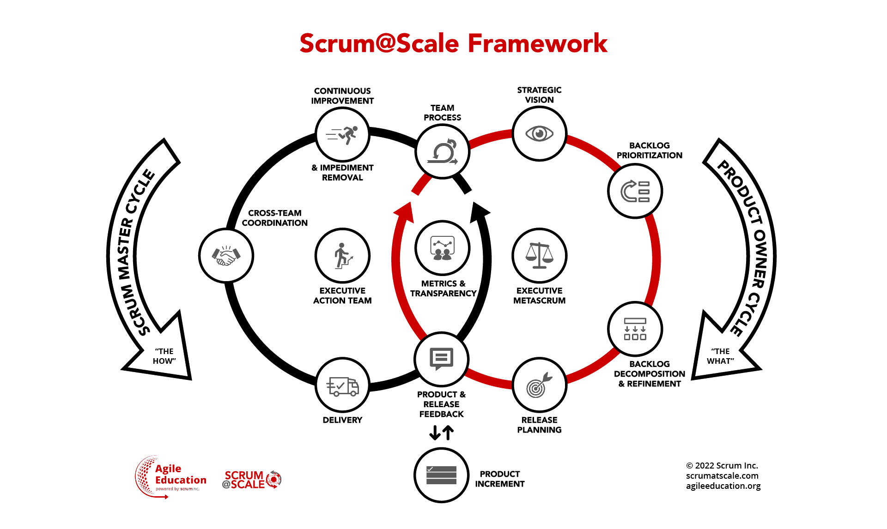
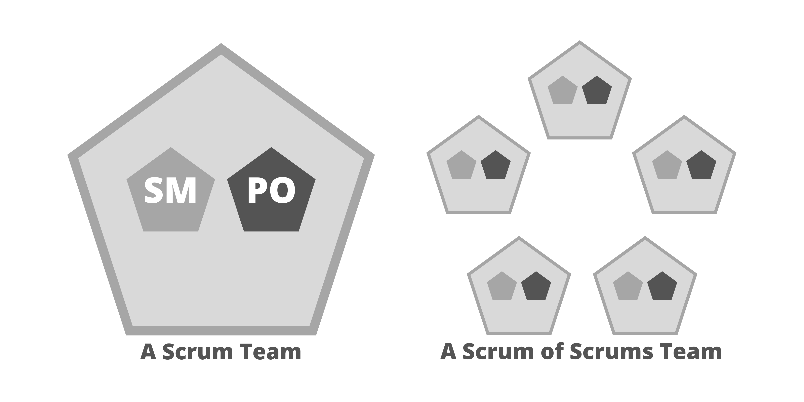
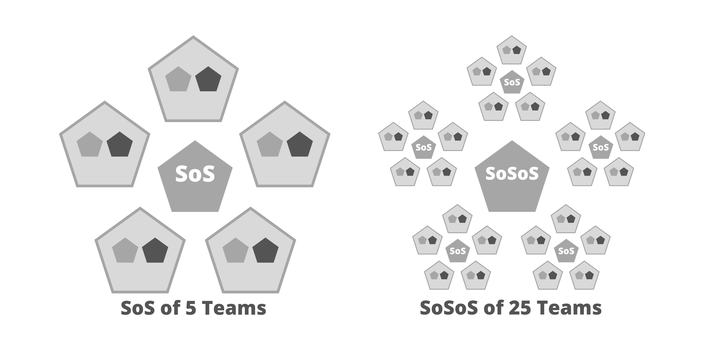
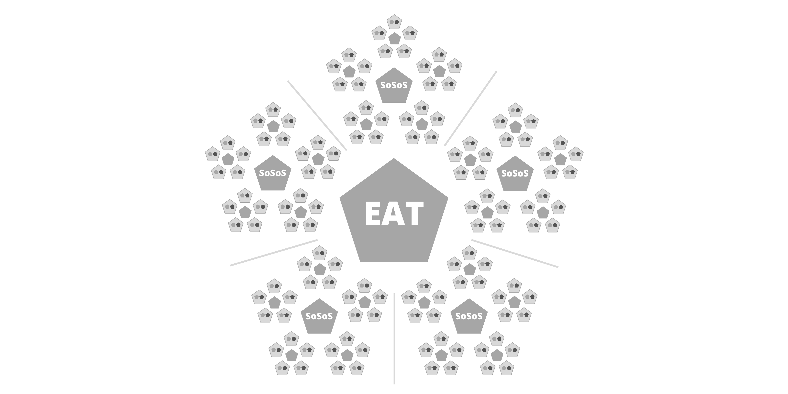
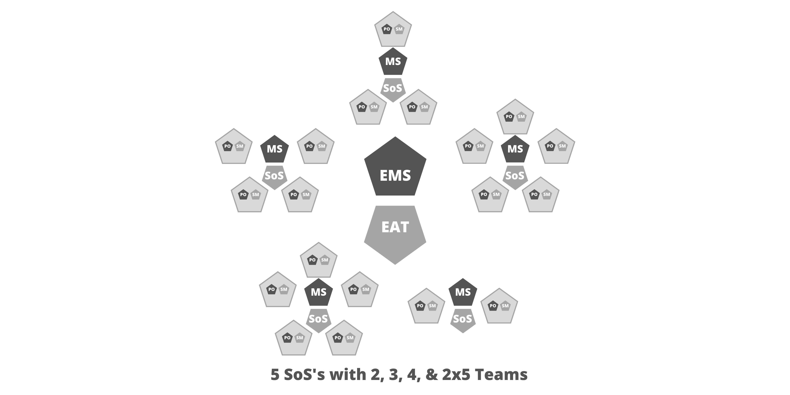
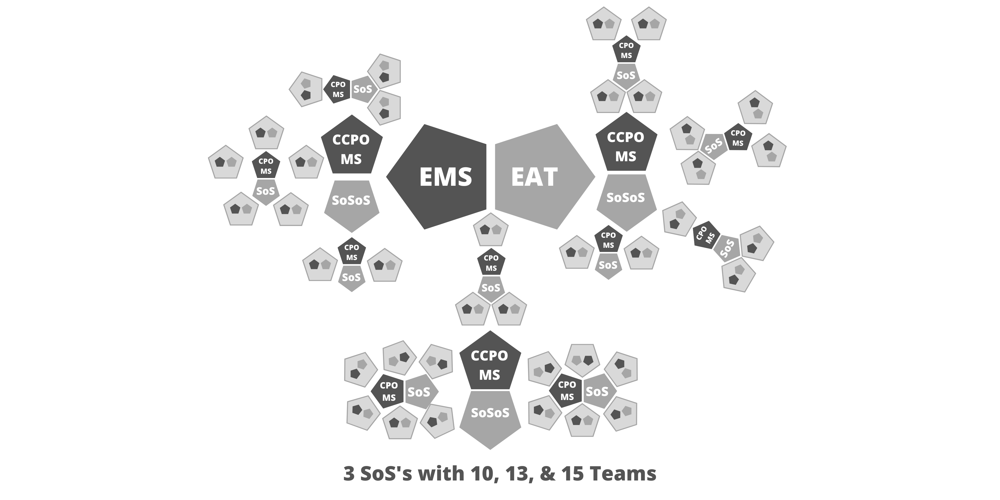
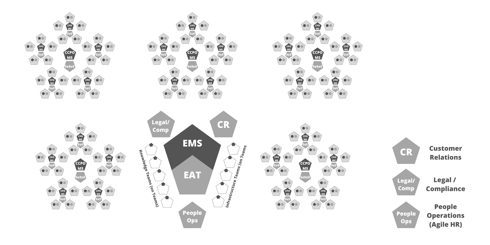

The Definitive Guide to Scrum@Scale: Scaling that Works

# Preface to the Scrum@Scale Guide

Scrum, as originally outlined in the Scrum Guide, is focused on a single Scrum Team being able to deliver optimal value while maintaining a sustainable pace. Since its inception, the usage of Scrum has extended to the creation of products, processes, and services that require the efforts of multiple teams.

In the field, it was repeatedly observed that as the number of Scrum Teams within an organization grew, two major issues emerged:

- The volume, speed, and quality of their output (working product) per team began to fall, due to issues such as cross-team dependencies, duplication of work, and communication overhead
- The original management structure was ineffective for achieving business agility. Issues arose like competing priorities and the inability to quickly shift teams around to respond to dynamic market conditions

To counteract these issues, a framework for effectively coordinating multiple Scrum Teams was clearly needed which would aim for the following:

- Linear scalability: A corresponding percentage increase in delivery of working product with an increase in the number of teams
- Business agility: The ability to rapidly respond to change by adapting the initial stable configuration

Scrum@Scale helps an organization to focus multiple networks of Scrum Teams on prioritized goals. It aims to achieve this by setting up a structure which naturally extends the way a single Scrum Team functions across a network and whose managerial function exists within a minimum viable bureaucracy (MVB).

A network can achieve linear scalability when its characteristics are independent of its size. Designing and coordinating a network of teams with this goal does not constrain growth in a particular way; instead, it allows for the network to grow organically, based on its unique needs, and at a sustainable pace of change that can be better accepted by the individuals involved.

A minimum viable bureaucracy is defined as having the least amount of governing bodies and processes needed to carry out the function(s) of an organization without impeding the delivery of customer value. It helps to achieve business agility by reducing decision latency (time to make a decision), which has been noted as a primary driver of success. In order to begin implementing Scrum@Scale, it is essential to be familiar with the Agile Manifesto and the 2020 Scrum Guide. A failure to understand the nature of agility will prevent it from being achieved. If an organization cannot Scrum, it cannot scale.

# Purpose of the Scrum@Scale Guide

This guide provides the definition of Scrum@Scale and the components of its framework. It explains the accountabilities of the scaled roles, scaled events, and enterprise artifacts, as well as the rules that bind them together.

This guide is broken down into four basic sections:

- an introduction to Scrum@Scale, with the basics for getting started
- an overview of the Scrum Master Cycle
- an overview of the Product Owner Cycle
- a walk-through of bringing the cycles together

Each component serves a specific purpose which is required for success at scale. Changing their core design or ideas, omitting them, or not following the base rules laid out in this guide limits the benefits of Scrum@Scale.

Specific tactics beyond the basic structure and rules for implementing each component vary and are not described in this Guide. Other sources provide complementary patterns, processes, and insights.

# Definitions

Scrum is a lightweight framework that helps people, teams and organizations generate value through adaptive solutions for complex problems.

The Scrum Guide describes the minimal set of elements that create a team environment that drives innovation, customer satisfaction, performance, and happiness. Scrum utilizes radical transparency and a series of formal events to provide opportunities to inspect and adapt a team and its product(s).

Scrum@Scale is a lightweight organizational framework in which a network of teams operating consistently with the Scrum Guide can address complex adaptive problems, while creatively delivering products of the highest possible value. These “products” may be physical, digital, complex integrated systems, processes, services, etc.

The Scrum@Scale Guide describes the minimal set of components to scale Scrum by using Scrum and its resulting business agility across an entire organization. It can be used in all types of organizations within industry, government, nonprofits, or academia. If an organization does not already use Scrum, it will require changes to its operating system.

In Scrum, care is taken to separate accountability of the “what” (product) from the “how” (process). The same care is taken in Scrum@Scale, so that jurisdiction and accountability are expressly understood. This eliminates wasteful organizational conflict that keep teams from achieving their optimal productivity. Because Scrum@Scale consists of components, it allows an organization to customize their transformation strategy and implementation. It gives an organization the ability to target incrementally prioritized change efforts in the area(s) deemed most valuable or most in need of adaptation and then progress on to others.

Scrum@Scale separates these components into two cycles: the Scrum Master Cycle (the “how”) and the Product Owner Cycle (the “what”), intersecting at two components and sharing a third. Taken as a whole, these cycles produce a powerful supporting structure for coordinating the efforts of multiple teams along a single path.

# The Components of Scrum@Scale

## Values-Driven Culture

Scrum@Scale aims to build a healthy organizational culture through the pillars of empirical process control and the Scrum Values. The pillars of empirical process control are transparency, inspection, and adaptation. These pillars are actualized by the Scrum values of Openness, Courage, Focus, Respect, and Commitment.

Openness supports transparency into all of the work and processes and without it, there is no ability to inspect them honestly and attempt to adapt them for the better. Courage refers to taking the bold leaps required to deliver value quicker in innovative ways. Focus and Commitment refer to the way we handle our work obligations, putting customer value delivery as the highest priority. Lastly, all of this must occur in an environment based on respect for the individuals doing the work, without whom nothing can be created.

Scrum@Scale helps organizations thrive by supporting a positive team learning environment for working at a sustainable pace, while putting customer value at the forefront.

## Getting Started: Installing an Agile Operating System

When implementing networks of teams, it is critical to develop a scalable Reference Model prior to scaling. The reference model is a small set of teams that coordinate to deliver every Sprint. As these teams successfully implement Scrum, the rest of the organization has a functioning, healthy example of Scrum to replicate. It serves as a prototype for scaling Scrum across the next network of teams. Any deficiencies in a Scrum implementation will be magnified when multiple teams are deployed. Scaling problems include organizational policies and procedures or development practices that block performance and frustrate teams.

In a scaled setting, the Reference Model is best enabled by grouping teams together that need to coordinate in order to deliver a fully integrated set of Increments into a Scrum of Scrums (SoS). To operate effectively, the Scrum of Scrums needs to be supported by a minimum viable bureaucracy composed of two leadership groups: an Executive MetaScrum (EMS) forum, focused on what is produced by the Scrum of Scrums and an Executive Action Team (EAT) focused on how they can get it done faster. The Executive MetaScrum and Executive Action Team components are the hubs around which each cycle revolves.

## Scaling The Teams

In Scrum, the ideal state is for a Scrum Team to be an independent path to production. As such, it needs members who have all the skills necessary to go from ideation to implementation. The Scrum of Scrums is a larger team of multiple teams that replicates this ideal at scale. Each team within the Scrum of Scrums must satisfy the Team Process component.

## The Team Process

The Team Process is Scrum as prescribed by the Scrum Guide. Since every Scrum Team has a Product Owner and a Scrum Master, it constitutes the first intersection between the Product Owner and Scrum Master Cycles. The goals of the Team Process are to:

- Maximize the flow of completed work that meets the Definition of Done
- Increase performance of the team over time
- Operate in a way that is sustainable and enriching for the team
- Accelerate the customer feedback loop

## The Scrum of Scrums (SoS)

A Scrum of Scrums operates as if it were a Scrum Team, satisfying the Team Process component with scaled versions of the Scrum accountabilities, events, and artifacts. While the Scrum Guide defines the optimal team size as being fewer than 10 people, Harvard research has determined that optimal team size is 4.6 people (on average). Therefore, the optimal number of teams in a Scrum of Scrums is 4 or 5.

As a dynamic group, the teams composing the Scrum of Scrums are responsible for a fully integrated set of potentially shippable increments of product at the end of every Sprint. Optimally, they carry out all of the functions required to release value directly to customers.

_NOTE: In the above and following diagrams, light-grey outlined pentagons represent a team. Where applicable, we have chosen to represent the SM & PO as smaller pentagons. These diagrams are meant to be examples only, as each organizational diagram may differ greatly._

## Scaling in Larger Organizations

Depending upon the size of an implementation, more than one Scrum of Scrums may be needed to deliver a complex product. In such cases, a Scrum of Scrum of Scrums (SoSoS) can be created out of multiple Scrums of Scrums. Each of these will have scaled versions of each Scrum of Scrums’ roles, artifacts, and events.

Scaling the Scrum of Scrums reduces the number of communication pathways within the organization so that complexity of communication overhead is limited. The SoSoS interfaces with a Scrum of Scrums in the exact same manner that a Scrum of Scrums interfaces with a single Scrum Team, which allows for linear scalability.

_NOTE: For simplicity, the numbers of teams and groupings in the sample diagrams are symmetrical. They are meant to be examples only, as each organizational diagram may differ greatly._

## Scaling the Events and Roles

If a Scrum of Scrums (SoS) operates as a Scrum Team, then it needs to scale the Scrum Events and the teams’ corresponding accountabilities. To coordinate the “how” in every Sprint, a SoS will need to hold scaled versions of the Daily Scrum and Sprint Retrospective. To coordinate the “what” in every Sprint, a SoS will need to hold scaled versions of Sprint Planning and a Sprint Review. As an ongoing practice, Backlog Refinement will also need to be done at scale.

The scaled versions of the Daily Scrum and Retrospective are facilitated by a Scrum Master for the group, called the Scrum of Scrums Master (SoSM). The scaled versions of the Sprint Review and Backlog Refinement are facilitated by a Product Owner Team guided by a Chief Product Owner (CPO). The scaled version of Sprint Planning is held with the Product Owner Team and the Scrum Masters. The Product Owner Team gains insight into what will be delivered in the current Sprint and the Scrum Masters gain insight into capacity and technical capabilities. The roles of Scrum of Scrums Master and Chief Product Owner scale into the leadership groups which then drive their corresponding cycles, satisfying the components of Scrum@Scale.

## Event: The Scaled Daily Scrum (SDS)

The main talking points of a Daily Scrum are the progress towards the Sprint Goal and impediments to meeting that commitment. In a scaled setting, the Scrum of Scrums needs to understand collective progress and be responsive to impediments raised by participating teams; therefore, at least one representative from each team attends a Scaled Daily Scrum (SDS). Any person or number of people from participating teams may attend as needed.

To optimize collaboration and performance, the Scaled Daily Scrum event mirrors the Daily Scrum, in that it:

- Is time-boxed to 15 minutes or less
- Must be attended by a representative of each team.
- Is a forum to discuss how teams can work together more effectively, what has been done, what will be done, what is going wrong & why, and what the group is going to do about it

Some examples of questions to be answered:

- What impediments does a team have that will prevent them from accomplishing their Sprint Goal or that will impact the delivery plan?
- Is a team doing anything that will prevent another team from accomplishing their Sprint Goal or that will impact their delivery plan?
- Have any new dependencies between the teams or a way to resolve an existing dependency been discovered?

## Event: The Scaled Retrospective

Every Sprint, the Scrum of Scrums holds a scaled version of the Sprint Retrospective where the Scrum Masters of each team get together and discuss what experiments have been done to drive continuous improvement and their results. Additionally, they should discuss the next round of experiments and how successful improvements can be leveraged across the group of teams or beyond.

# The Scrum Master Cycle: Coordinating the “How”

## Role: The Scrum of Scrums Master (SoSM)

The Scrum Master of the Scrum of Scrums is called the Scrum of Scrums Master (SoSM). The Scrum of Scrums Master is accountable for ensuring the Scaled events take place, are productive, positive, and kept within the time-box. The Scrum of Scrums Master may be one of the team’s Scrum Masters or a person specifically dedicated to this role. They are accountable for the release of the joint teams’ efforts and continuously improving the effectiveness of the Scrum of Scrums. This includes greater team throughput, lower cost, and higher quality. In order to achieve these goals, they must:

- Work closely with the Chief Product Owner to deliver a potentially releasable product increment at least every Sprint
- Coordinate the teams’ delivery with the Product Owners Team’s release plans
- Make impediments, process improvements, and progress visible to the organization
- Facilitate the prioritization and removal of impediments, paying particular attention to cross-team dependencies

The Scrum of Scrums Master is a true leader who serves the teams and the organization by understanding cross-team dependencies, including those outside of the Scrum of Scrums and enabling cross-team coordination and communication. They are accountable for keeping the Chief Product Owner, stakeholders, and larger organization informed by radiating information about product development progress, impediments removal status, and other metrics. The Scrum of Scrums Master leads by example, mentoring others to increase the effectiveness and adoption of Scrum throughout the organization.

In the case where multiple Scrum of Scrums are grouped into a Scrum of Scrum of Scrums, then a Scrum of Scrum of Scrums Master (SoSoSM) is needed to coordinate from that wider perspective.

## The Hub of the SM Cycle: The Executive Action Team (EAT)

The Executive Action Team (EAT) fulfills the Scrum Master accountabilities for an entire agile organization. This leadership team creates an agile ecosystem that allows the Reference Model to function optimally, by:

- implementing the Scrum values
- assuring that Scrum roles are created and supported
- Scrum events are held and attended
- Scrum Artifacts and their associated commitments are generated, made transparent, and updated throughout each Sprint.
- formulating guidelines and procedures that act as a translation layer between the Reference model and any part of the organization that is not agile.

The Executive Action Team is accountable for removing impediments that cannot be removed by members of the Scrum of Scrums (or wider network). Therefore, it must be comprised of individuals who are empowered, politically and financially, to remove them. The function of the Executive Action Team is to coordinate multiple Scrums of Scrums (or wider networks) and to interface with any non-agile parts of the organization. As with any Scrum Team, it needs a Product Owner, a Scrum Master, and a transparent backlog.

_Sample Diagram showing an EAT coordinating 5 groupings of 25 teams_

## EAT Backlog and Responsibilities

The product of the Executive Action Team (EAT) is the creation of an Agile operating system for the organization. The EAT curates a Product Backlog consisting of initiatives for the ongoing transformation of the organization to achieve the goal of greater business agility. This backlog also includes process improvements which remove impediments and ones that need to be standardized.

The Executive Action Team’s responsibilities include, but are not limited to:

- Creating an agile operating system for the Reference Model as it scales through an organization, including corporate operational rules, procedures, and guidelines to enable agility
- Ensuring a Product Owner organization is created, funded, and supported
- Measuring and improving the quality of Scrum in an organization
- Building capability within an organization for business agility
- Creating a center for continuous learning for Scrum professionals
- Supporting the exploration of new ways of working

The function of the Executive Action Team is to see that this backlog is carried out. They may do this themselves or empower another group to do it. As the Executive Action Team is accountable for the quality of Scrum within the organization, the entire Scrum Master organization reports into them.

The Scrum Master organization (Scrum Masters, Scrum of Scrum Masters, and the Executive Action Team) work as a whole to implement the Scrum Master Cycle components. These unique components are:

- Continuous Improvement and Impediment Removal
- Cross-Team Coordination
- Delivery

## Continuous Improvement and Impediment Removal

Ideally, impediments should be removed as quickly as possible. This is critical to avoid scaling the impediments themselves, and because unresolved impediments may slow productivity. Therefore, the goals of Continuous Improvement and Impediment Removal are to:

- identify impediments and reframe them as opportunities to improve
- ensure transparency and visibility in the organization to effect change
- maintain an effective environment for prioritizing and removing impediments
- verify that improvements have positively impacted team and/or product metrics

## Cross-Team Coordination

When multiple teams are needed for the creation of a shared product, streamlined collaboration is required for success. Therefore, the goals of Cross-Team Coordination are to:

- sync up similar processes across multiple related teams
- mitigate cross-team dependencies to ensure they do not become impediments
- maintain alignment of team norms and guidelines for consistent output

## Delivery

Since the goal of the Scrum of Scrums is to function as a single unit and release together, how the product is delivered falls under their scope as a group. The Product Owner Team determines both the content of the release and the optimal time to deliver the increment to customers. Therefore, the goals of Delivery for the Scrum of Scrums are to:

- deliver a consistent flow of valuable finished product to customers
- integrate the work of different teams into one seamless product
- ensure a high-quality customer experience

# The Product Owner Cycle: Coordinating the “What”

## Scaling the Product Owner – The Product Owner Cycle

For each Scrum of Scrums, there is a shared common backlog that feeds the network of teams. It requires a Product Owner Team (PO Team), including a Chief Product Owner, who is accountable as the Product Owner for the group of teams. The PO Team’s main focus is ensuring that the individual teams’ priorities follow along a single path. This allows them to coordinate their individual team’s backlogs and build alignment with stakeholders and customer needs.

Each team’s Product Owner is accountable for the composition and prioritization of their team’s Sprint backlog and may pull items from the common backlog or generate independent backlog items at their discretion as needed to meet business objectives.

The main functions of the Product Owner Team are to:

- communicate the overarching vision for the product & make it visible to everyone in the organization
- build alignment with key stakeholders to secure support for backlog implementation
- generate a single, prioritized backlog; ensuring that duplication of work is avoided
- work with the Scrum of Scrums Master to create a minimally uniform “Definition of Done” that applies to all team
- eliminate dependencies raised by the teams
- generate a coordinated Roadmap and Release Plan
- monitor metrics that give insight into the product and the market

## Role: The Chief Product Owner (CPO)

The Chief Product Owner coordinates priorities with the Product Owner Team. Together they align backlog priorities with stakeholder and customer needs. The CPO may be an individual team Product Owner who plays this role as well, or they may be a person specifically dedicated to it. Their main responsibilities are the same as a regular Product Owner’s now scaled:

- Setting a strategic vision for the whole product
- Creating a single, prioritized backlog to be delivered by all of the teams
- Decide which metrics the Product Owner Team will monitor
- Assess customer product feedback and adjust the common backlog accordingly
- Facilitate the MetaScrum event (see below)

The Chief Product Owner is accountable along with their associated Scrum of Scrums Masters for the efficient delivery of product increments according to the Release Plan.

## Scaling the Product Owner Team

Having Product Owner Teams enables a network design of Product Owners which scales along with their associated Scrum of Scrums. There is no specific term associated with these expanded units, nor do the Chief Product Owners of them have specific expanded titles. Each organization is encouraged to develop their own.

## The Hub of the PO Cycle: The Executive MetaScrum (EMS)

To fulfill the Product Owner role for the entire agile organization, the Chief Product Owners meet with executives and key stakeholders at an Executive MetaScrum event. This event is derived from the MetaScrum pattern. It is _the forum_ for Leadership and other stakeholders to express their preferences to the PO Team, negotiate priorities, alter budgets, or realign teams to maximize the delivery of value. At no other time during the Sprint should these decisions be made.

At the Executive MetaScrum a dynamic group of leaders sets the organizational vision and the strategic priorities, aligning all of the teams around common goals. In order to be effective, the Chief Product Owner facilitates and each team’s Product Owner (or a proxy) must attend. This event occurs as often as needed- at least once per Sprint- to ensure an aligned backlog within the Scrum of Scrums. Optimally, this group of leaders operates as a scrum team.

In the case of larger implementations where there are multiple Scrum of Scrums, there may be multiple MetaScrums which have their strategic backlog created and prioritized at an Executive MetaScrum.

## Coordinating the “What” – The Product Owner Cycle

The Product Owner organization (the Product Owners, the Chief Product Owners, and the Executive MetaScrum) work as a whole to satisfy the unique components of the Product Owner Cycle:

- Strategic Vision
- Backlog Prioritization
- Backlog Decomposition & Refinement
- Release Planning

## Strategic Vision

A compelling vision attracts both customers and great employees. Therefore, formulate a Strategic Vision to be communicated, both externally and internally, with the goals of:

- aligning the entire organization along a shared path forward
- compellingly articulating why the organization and its products exist
- clarity allowing for the creation of concrete Product Goals
- describing what the organization will do to leverage key assets
- being able to respond to rapidly changing market conditions

## Backlog Prioritization

Proper backlog prioritization is essential for teams to work in a coordinated manner to optimize value delivery. Competition between priorities creates waste because it pulls teams in opposing directions. The goals of Backlog Prioritization are to:

- identify a clear ordering for products, capabilities, and services to be delivered
- reflect value creation, risk mitigation, and internal dependencies in ordering of the backlog
- prioritize the high-level initiatives across the entire agile organization prior to Backlog Decomposition and Refinement

## Backlog Decomposition and Refinement

A Chief Product Owner’s backlog contains items which are larger in scope than an individual team’s backlog. To pull prioritized items into individual teams, they may need to be broken down and understood better. The goals of Backlog Decomposition and Refinement are to:

- identify the complex products, projects, and associated Product Goals which will make the vision a reality
- break those complex products and projects into independent elements
- ensure all backlog items can be refined further by the teams into items they can complete in one Sprint

## Release Planning

Release Planning may encompass one or many releases of the product to a customer. It is a longer-term planning horizon than a single Sprint. The goals of Release Planning are to:

- forecast the delivery timeline of key Product Increments and capabilities.
- communicate delivery expectations to stakeholders.
- communicate the financial impact of the delivery schedule.

# Connecting the Product Owner and Scrum Master Cycles

The cycles first intersect at the Team Process component. From that point, the accountability for the “what” and “how” separate until done product gets delivered. The cycles connect again within the Feedback component where customer response to the product is interpreted. This requires Metrics in order to make empirical decisions about adapting for the next delivery cycle. The Product Owner and Scrum Master organizations work together to fulfill the requirements of these components.

## Product Feedback and Release Feedback

Product feedback is interpreted by the Product Owner organization to drive continuous improvement of the product through updating the Product Backlog(s). Release feedback is interpreted by the Scrum Master organization to drive continuous improvement of the Delivery mechanisms. The goals of obtaining and analyzing Feedback are to:

- validate assumptions
- understand how customers use and interact with the product
- capture new ideas and emerging requirements for new functionality

## Metrics and Transparency

Metrics may be unique to both specific organizations as well as to specific functions within those organizations. Scrum@Scale does not require any specific set of metrics, but it does suggest that at a bare minimum, the organization should measure:

- Productivity – e.g. change in amount of working product delivered per Sprint
- Value Delivery – e.g. business value per unit of team effort
- Quality – e.g. defect rate or service down-time
- Sustainability – e.g. team happiness

Radical transparency is essential for Scrum to function optimally, giving the organization the ability to honestly assess its progress and to inspect and adapt its products and processes.

The goals of having Metrics and Transparency are to:

- provide the appropriate context with which to make data-driven decisions
- reduce decision latency
- streamline the work required by teams, stakeholders or leadership

## Some Notes on Organizational Design

The goal of organizational design with Scrum@Scale is to allow it to be component-based, just like the framework itself. This permits for rebalancing or refactoring of teams in response to the market.

Sample diagrams:

Customer Relations, Legal / Compliance, and People Operations are included here since they are necessary parts of organizations and will exist as independent Scrum Teams on their own, upon which all other teams may rely.

A final note on the representation of the Executive Action Team and the Executive MetaScrum: In this diagram, they are shown as overlapping since some members are a part of the EAT and attend the EMS event. In very small organizations or implementations, the Executive Action Team members and the attendees of the Executive MetaScrum event may consist entirely of the same people.

_In this organizational diagram, the Knowledge and Infrastructure Teams represent virtual teams of specialists of which there are too few to staff each team. If they act as shared-services team, they coordinate with the Scrum Teams as a group, where requests flow through a Product Owner for each specialty who converts them into a transparent prioritized backlog. An important note is that these teams are NOT silos of individuals who sit together (this is why they are represented as hollow pentagons); their team members sit on the actual Scrum Teams, but they make up this virtual Scrum of their own for the purpose of backlog dissemination and process improvement._

# End Note

Scrum@Scale is designed to scale productivity, to get an entire organization delivering twice the value at half the cost. Implementing a streamlined workflow at a sustainable pace with better decision making improves the work environment, increases business agility, and generates higher returns to all stakeholders.

Scrum@Scale is designed to saturate an organization with Scrum. Well implemented Scrum can run an entire organization with Scrum@Scale as the operating system.

# Acknowledgements

## History

Dr. Jeff Sutherland developed Scrum@Scale based on the fundamental principles behind Scrum, Complex Adaptive Systems theory, game theory, and his work in biology. The original version of this guide was created by collaboration with Jessica Larsen, Avi Schneier, and Alex Sutherland. Subsequent editions have been refined with the input of many experienced Scrum practitioners based on the results of their field work.

## People and Organizations

We acknowledge IDX for the creation of the Scrum of Scrums which first allowed Scrum to scale to hundreds of teams, PatientKeeper for the creation of the MetaScrum, which enabled rapid deployment of innovative product, and OpenView Venture Partners for scaling Scrum to the entire organization. We value input from Intel, who taught us “nothing scales except a scale-free architecture”, and SAP, with the largest Scrum team product organization, who taught us management involvement in the MetaScrum is essential to get more than 2,000 Scrum Teams to work together.

The agile coaches and trainers implementing these concepts at Amazon, GE, 3M, Toyota, Spotify, Maersk, Comcast, AT&T and many other companies have been helpful in testing these concepts across a wide range of businesses across different domains

1. “Business agility.” Wikipedia, Last modified 27 February 2020. [https://en.wikipedia.org/wiki/Business_agility](https://en.wikipedia.org/wiki/Business_agility).
2. Johnson, Jim. New CHAOS Report. The Standish Group. 2018.
3. Ogunnaike, Babatunde A. and Ray, W. Harmon. Process Dynamics, Modeling and Control. Oxford University Press. 1994.
4. Hackman, J Richard. Leading Teams: Setting the Stage for Great Performances. Harvard Business Press. 2002.
5. Sutherland, Jeff, Coplien, James O., and The Scrum Patterns Group. A Scrum Book: The Spirit of the Game. Pragmatic Bookshelf. 2019.
6. Sutherland, Jeff. “Inventing and Reinventing SCRUM in five Companies.” Sur le site officiel de l’alliance agile. 2001.
7. Sutherland, Jeff. “Future of Scrum: Parallel Pipelining of Sprints in Complex Projects.” Proceedings of the Agile Development Conference. IEEE Computer Society 90-102. 2005.
8. Sutherland, Jeff and Altman, Igor. “Take No Prisoners: How a Venture Capital Group Does Scrum.” Agile Conference, 2009. AGILE’09, IEEE 350-355. 2009.
